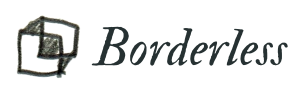

 <b>a lightweight ui-less image viewer</b>

## lightweight you say?

written in c++. opens in less than a second

## and ui less too?

borderless and ui-less. you can interact with it via right click menu or keymaps.

keymaps being:

left/right to navigate through the folder.

escape to quit.

scrollwheel to zoom in/out.

drag to move

## features

fully transparent window

animated gif/webp support

always on top toggle

bilinear/nearest-neighbor interpolation toggle

copy/paste to/from clipboard button

open containing folder button

supports .png, .jpg, .gif, .webp, .tiff, .svg, .svgz, .bmp, .tga, .cur, .ico, .jfif, .pbm, .pgm, .ppm, .xbm, .xpm, .icns, .jp2, .mng, .wbmp

## building the thing

i built it on qt, forgot which version. you can try to use qt creator and may god be on your side.

## can i have a screenshot?

no
